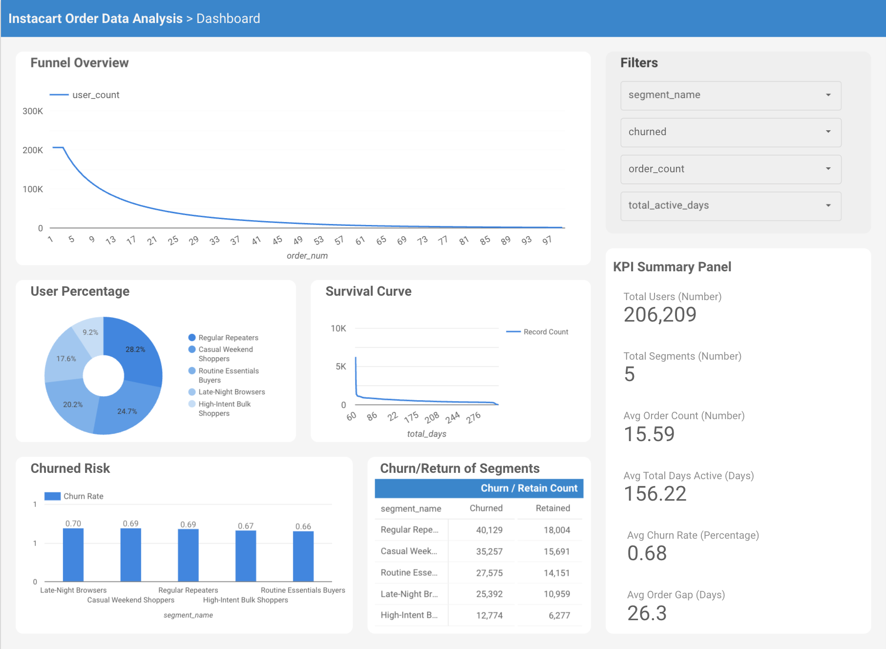
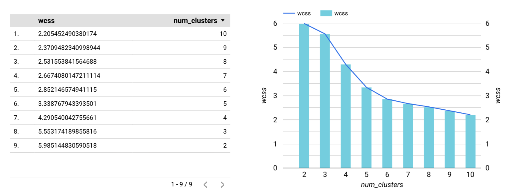
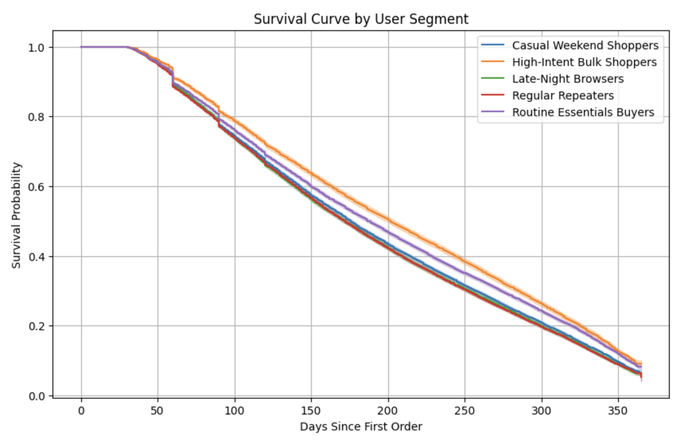

# Instacart_User_Retention_Analysis

This project analyzes user purchase behavior on Instacart to uncover actionable insights across the conversion funnel, customer retention, and churn patterns. The final outcome is an interactive Looker Studio dashboard powered by Google BigQuery and SQL modeling.

## 🔍 Project Overview

- **Goal**:
  - Understand Instacart user behavior from first order through long-term retention and churn.
- **Data Sources**:
  - This project uses data from the [Kaggle Instacart Market Basket Analysis competition](https://www.kaggle.com/datasets/psparks/instacart-market-basket-analysis), which contains anonymized grocery shopping behavior for over 200,000 Instacart users. The dataset includes 6 core tables:
  - `orders` – Order history for each user  
  - `order_products__prior` – Products purchased in users’ prior orders  
  - `order_products__train` – Products in users' most recent orders (for training)  
  - `products` – Product details (IDs, names, department, aisle)  
  - `aisles` – Aisle-level grouping of products  
  - `departments` – Department-level grouping of products
- **Tools Used**: 
  - Google BigQuery (SQL)
  - Looker Studio (Dashboarding)
  - Python (for survival analysis and data transfer)
- **Key Techniques**:
  - Funnel Analysis
  - User Segmentation
  - Churn Rate Estimation
  - Kaplan-Meier Survival Curves

## 📊 Live Dashboard

🔗 **[👉 View the Live Dashboard in Looker Studio](https://lookerstudio.google.com/reporting/be935d0a-10e1-4bcb-956a-df4bf746c59a)**

Explore funnel performance, churn rates, and retention trends interactively.

- **Funnel Overview**: Visualizes user drop-off by number of orders placed.
- **User Segments**: Breaks down behavioral patterns by cluster groups (e.g., Casual Shoppers vs. Bulk Buyers).
- **Churn Risk**: Segment-level churn rates based on order inactivity.
- **Retention Modeling**: Survival curve showing number of continued activity user over time.
- **Interactive Filters**: Dynamically explore metrics by segment, churn status, order count, and activity span.

## 🧩 User Segmentation

To group users by behavioral traits and enable personalized insights, we applied **unsupervised clustering** using BigQuery ML’s KMeans algorithm.

### 🧠 What We Did
- Selected users’ **first order behavior features**, such as:
  - Number of products
  - Number of aisles
  - Hour and day of purchase
- Applied **KMeans clustering (k=5)** to segment users into distinct behavior groups.
- Interpreted and labeled each cluster based on real-world shopping patterns.

### 📈 Why It Matters
- Reveals **distinct shopper personas**, e.g., “Weekend Loyal Buyers” vs. “Small Night Shoppers.”
- Enables **targeted churn, retention, and funnel analysis** across segments.
- Supports **personalized marketing** and product strategy for different user types.

## ⏳ Survival Analysis: Kaplan-Meier Method

To estimate user retention over time, we applied the **Kaplan-Meier survival analysis** using the `lifelines` Python package in Google Colab.
[]

### 🧠 What We Did
- Modeled **time-to-churn** based on days between user orders.
- Segmented retention curves by behavioral clusters.
- Used the **Kaplan-Meier estimator** to visualize survival probability over time.

### 📈 Why It Matters
- Helps understand **when users are most likely to churn**.
- Allows comparison of **retention trends across segments**.
- Informs lifecycle marketing and re-engagement strategy.

## 🧠 Key Insights

- Late-night browsers had the **highest churn rate (0.70)** among all segments.
- Regular repeaters and casual weekend shoppers showed strong early retention but weaker long-term activity.
- The average user places **15.6 orders** over **156 days** with a churn rate of **~68%**.

## 🔍 Project Summary (Highlight and Limitations)

### ✅ Highlights
- Efficiently transferred **713MB+ data (3M+ records)** from Kaggle to **Google Cloud Storage** using API, then ingested to **BigQuery**, reducing manual upload time by **over 80%**.
- Leveraged `order_number` as a proxy for event timestamps, enabling **accurate time-based funnel and retention analysis** even without raw timestamps.
- Successfully built an **interactive, filterable dashboard** in Looker Studio to uncover behavioral insights and segment-specific churn risks.

### ⚠️ Limitations
- The dataset is originally designed for **product analytics** rather than user lifecycle tracking, which may limit **depth of user behavior insights**.
- Proxy timestamp (`order_number`) does not account for **real-world gaps between purchases**, which could affect time-sensitive models like churn prediction or seasonality analysis.

